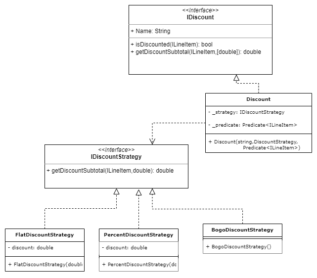
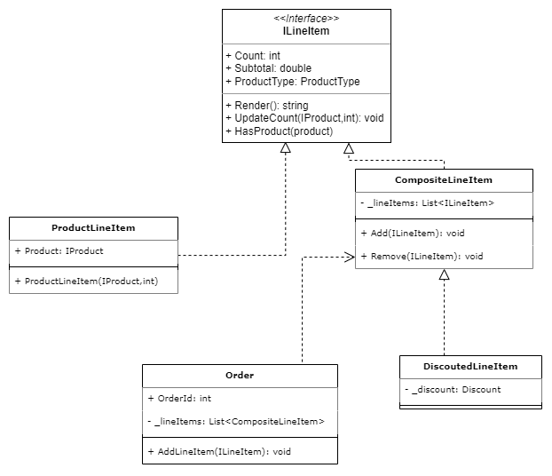

*this report must contain:*
- Description of the system
- Objectives of the design patters
- UML structure for classes

# OmegaBakery

## Products

## Discounts

Discounts represent a reduction in cost on specific purchases based on product types and quantities. A discount will only apply to ILineItem objects that meet pass a **Predicate** passed into the discount on instantiation. The **Strategy** design pattern is used for the discount subtotal calculation allowing us to use several types of discounts:
- **FlatDiscountStrategy**: Removes a flat dollar amount from the subtotal
- **PercentDiscountStrategy**: Removes a percentage of the subtotal
- **BogoDiscount**: Removes the cost of 1 item for every 2 items purchased

Discounts can be easily extended in the future to accommodate different discount conditions.

Discounts are applied to **ILineItem**s through the **DiscountedLineItem** class, which is an extension of **CompositeLineItem**. When an **ILineItem** is updated such that a discount is no longer applicable, the **DiscountedLineItem** class behaves the same as a **CompositeLineItem**. 

Discounts require flexibility for how they are applied to line items. For example, the same discount could apply in these three orders:

- A single line item of 12 plain bagels
- 3 line items, each containing 4 bagels of a unique flavour
- A line item that has already been discounted for clearance
****

## Line Items

Line Items use the **composite** design pattern, which allows us to apply *IDiscount*s to either a single line item or multiple line items

## Orders
An **Order** represents the current state of a user's cart. It contains the logic for adding items to a purchase, updating item count, and applying discounts.

To simplify the process of applying discounts, line items are automatically grouped into CompositeLineItems of the same ProductType.

## Administration

## Data
